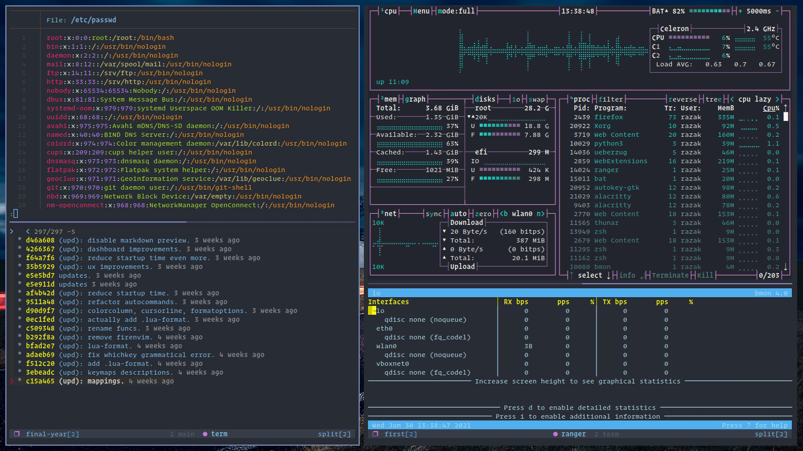

# Dotfiles



  ## Installation

You will need `git`

Run the install script. Files are cloned to `~/.dots/dotfiles` by default. (Bare repo)
```bash
curl -s https://raw.githubusercontent.com/razak17/dotfiles/main/install.sh | sh

```
Old files are stored in `~/.config-backup`
